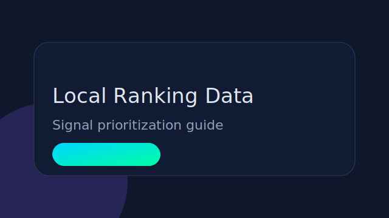
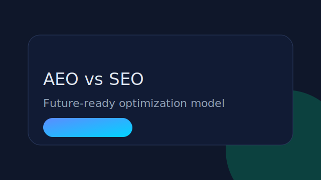

# SEO Autoblog Money

  
Modern Tech Platform

  <h1>Automation, AI Tools & Tech Workflows</h1>
  
Discover the best automation tools, AI platforms and workflows to build faster and work smarter.

  

    <a class="btn btn-primary" href="guides/">Explore Guides</a>
    <a class="btn btn-secondary" href="reviews/">Recommended Tools</a>
  

  

    
<strong>Daily</strong>Automated publishing

    
<strong>Long-form</strong>1200-1800 words

    
<strong>SEO-Ready</strong>Schema + Sitemap + RSS

  

## Latest Articles

  <a class="feature-card" href="posts/best-ai-automation-tools-for-developers/">New<h3>Best AI automation tools for developers</h3>
A modern stack to reduce repetitive coding tasks and boost delivery speed.
</a>
  <a class="feature-card" href="posts/best-productivity-tools-powered-by-ai/">New<h3>Best productivity tools powered by AI</h3>
Practical tools that improve focus, planning, and execution every day.
</a>
  <a class="feature-card" href="posts/top-workflow-automation-tools-in-2026/">New<h3>Top workflow automation tools in 2026</h3>
Current automation platforms compared for operations and growth teams.
</a>

## Featured Articles

  <article class="article-card">
    
    

      AI SEO
      <h3><a href="posts/how-to-build-an-ai-seo-strategy-that-outlasts-tactics-via-sejournal-kevinindig/">How to Build an AI SEO Strategy</a></h3>
      
Build resilient growth loops that survive algorithm shifts and platform cycles.

      
10 min readStrategy

    

  </article>

  <article class="article-card">
    
    

      Local SEO
      <h3><a href="posts/the-data-reveals-whats-driving-local-rankings-now-via-sejournal-hethrcampbell/">What Drives Local Rankings Now</a></h3>
      
A focused summary of ranking factors that matter most for local visibility in 2026.

      
8 min readData

    

  </article>

  <article class="article-card">
    
    

      AEO
      <h3><a href="posts/answer-engine-optimization-vs-traditional-seo-what-marketers-need-to-know/">AEO vs Traditional SEO</a></h3>
      
How to optimize for AI answer engines while preserving core technical SEO fundamentals.

      
11 min readFuture-proofing

    

  </article>

## Recommended Tools

  <article class="tool-card">
    

      
      

        <h3>Keyword Suite Pro</h3>
        
Semantic keyword research for modern search.

      

    

    <ul>
      <li>Entity-based keyword clusters</li>
      <li>Opportunity scoring by intent</li>
      <li>Content brief export</li>
    </ul>
    

      <a class="btn btn-primary" href="reviews/">Try it</a>
      Trusted by SEO teams
    

  </article>

  <article class="tool-card">
    

      
      

        <h3>Audit Cloud</h3>
        
Technical SEO quality control at scale.

      

    

    <ul>
      <li>Crawl issue prioritization</li>
      <li>Core Web Vitals tracking</li>
      <li>Automated reports</li>
    </ul>
    

      <a class="btn btn-primary" href="reviews/">Try it</a>
      Conversion-safe recommendations
    

  </article>

  <article class="tool-card">
    

      
      

        <h3>Content Radar</h3>
        
Workflow automation for editorial pipelines.

      

    

    <ul>
      <li>Brief templates and governance</li>
      <li>Internal linking suggestions</li>
      <li>Freshness alerts</li>
    </ul>
    

      <a class="btn btn-primary" href="reviews/">Try it</a>
      Editorially reviewed
    

  </article>

## Automation Guides

  <a class="feature-card" href="guides/guia-pilar-seo-para-creadores/">
    Pillar
    <h3>SEO System Blueprint</h3>
    
Architecture, content, and conversion foundations for scalable organic growth.

  </a>
  <a class="feature-card" href="guides/">
    Playbooks
    <h3>Execution Frameworks</h3>
    
Discover, generate, optimize and distribute with repeatable workflows.

  </a>

## Newsletter

  <h2>Get weekly automation and SEO playbooks</h2>
  
Actionable ideas for AI workflows, growth loops and high-conversion content systems.

  <form class="newsletter-form" action="mailto:?subject=Newsletter%20Signup" method="post" enctype="text/plain">
    <input type="email" name="email" placeholder="you@company.com" required>
    <button type="submit" class="btn btn-primary">Join Newsletter</button>
  </form>

<footer class="site-footer reveal">
  

    

      <h4>Categories</h4>
      <a href="posts/">Articles</a>
      <a href="guides/">Automation Guides</a>
      <a href="reviews/">Tools</a>
    

    

      <h4>Resources</h4>
      <a href="assets/lead-magnet/">Lead Magnet</a>
      <a href="newsletter/">Newsletter</a>
      <a href="components/ui-kit/">UI Kit</a>
    

    

      <h4>About</h4>
      <a href="https://github.com/pjgiraldob/seo-autoblog-money">GitHub</a>
      <a href="https://x.com">X</a>
      <a href="https://linkedin.com">LinkedIn</a>
    

  

</footer>

